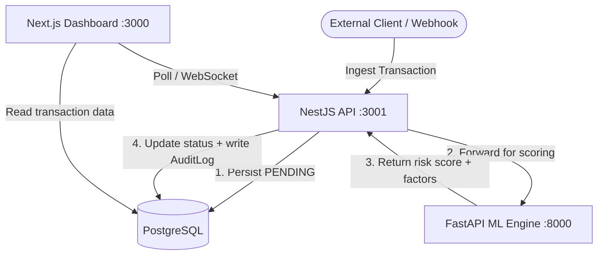

# Fraudies — Fraud Detection Platform

A modular, full-stack fraud detection system combining deterministic velocity rules with a machine learning scoring engine to assess transaction risk in real time. Built as a portfolio demonstration of enterprise fraud-monitoring architecture patterns.

> **Note:** This project is designed for evaluation and demonstration purposes. It is not intended for production deployment in regulated financial environments without independent security review, compliance assessment, and appropriate institutional sign-off.

---

## Table of Contents

1. [Overview](#1-overview)
2. [System Architecture](#2-system-architecture)
3. [Dashboard Screenshots](#3-dashboard-screenshots)
4. [Quick Start Demo](#4-quick-start-demo)
5. [Transaction Lifecycle](#5-transaction-lifecycle)
6. [Machine Learning Risk Engine](#6-machine-learning-risk-engine)
7. [Fraud Detection Logic](#7-fraud-detection-logic)
8. [Database Schema](#8-database-schema)
9. [Repository Structure](#9-repository-structure)
10. [Technology Stack](#10-technology-stack)
11. [Performance Benchmarks](#11-performance-benchmarks)
12. [Security Architecture](#12-security-architecture)
13. [Threat Model](#13-threat-model)
14. [API Reference](#14-api-reference)
15. [Local Development Setup](#15-local-development-setup)
16. [Testing](#16-testing)
17. [CI/CD Pipeline](#17-cicd-pipeline)
18. [Operational Monitoring](#18-operational-monitoring)
19. [Scalability](#19-scalability)
20. [Operational Scripts](#20-operational-scripts)
21. [License](#21-license)

---

## 1. Overview

Fraudies is a three-service fraud detection system: a NestJS REST API that handles ingestion and orchestration, a FastAPI ML inference engine that scores transaction risk, and a Next.js analyst dashboard for real-time monitoring. PostgreSQL stores all transaction records and audit history. Redis handles velocity-based rule checks.

**Core capabilities:**

- Classifies inbound transactions as `APPROVED`, `PENDING`, or `FLAGGED` in a single synchronous request cycle
- Produces human-readable risk factor annotations alongside every numeric score
- Writes an append-only `AuditLog` entry (enforced by a PostgreSQL trigger) for every transaction decision
- Supports JWT-authenticated REST API access and pre-shared-secret webhook ingestion
- Exposes aggregate fraud metrics and alert queues through a WebSocket-connected analyst dashboard

---

## 2. System Architecture

```
┌────────────────────────────────────────────────────────────────────┐
│                        External Ingestion                          │
│               Client Applications  ·  Upstream Webhooks           │
└──────────────────────────┬─────────────────────────────────────────┘
                           │  HTTPS  /  X-Webhook-Secret header
                           ▼
┌────────────────────────────────────────────────────────────────────┐
│                  NestJS Orchestration API  (:3001)                 │
│           Auth  ·  Routing  ·  Webhook Ingestion  ·  Audit         │
└────────┬────────────────────────┬─────────────────────┬────────────┘
         │                        │                     │
         ▼                        ▼                     ▼
┌──────────────┐     ┌────────────────────────┐  ┌──────────────────┐
│  PostgreSQL  │     │  FastAPI ML Engine     │  │  Redis           │
│  via Prisma  │     │  (:8000)               │  │  Velocity Rules  │
│              │     │  Risk Scoring          │  │  <1ms checks     │
└──────────────┘     └────────────────────────┘  └──────────────────┘
         ▲
         │  WebSocket / Polling
┌────────┴───────────────────────────────────────────────────────────┐
│                  Next.js Analyst Dashboard  (:3000)                │
│         Real-time Alerts  ·  Transaction Queue  ·  Metrics         │
└────────────────────────────────────────────────────────────────────┘
```



**Design rationale for service isolation:** The ML engine holds no database credentials and cannot directly read from or write to PostgreSQL. It receives only the minimum transaction fields required for scoring and returns a structured JSON response. This limits the impact of any ML-layer compromise to scoring logic alone — it cannot access user data, audit records, or authentication state.

---

## 3. Dashboard Screenshots

> Screenshots should be captured after running the local development setup and added here before distributing this document.
>
> Recommended captures:
> - **Main analyst dashboard** — full transaction feed with status badges and risk indicators
> - **Transaction detail view** — risk score breakdown with annotated factor list
> - **Flagged alerts queue** — filtered view of `FLAGGED` transactions awaiting review
> - **Aggregate metrics panel** — approval rate, alert frequency, volume charts

```
[ Dashboard screenshot — add before distribution ]
[ Alert queue screenshot — add before distribution ]
[ Risk detail view screenshot — add before distribution ]
[ Metrics panel screenshot — add before distribution ]
```

---

## 4. Quick Start Demo

The fastest way to see the system running end-to-end:

```bash
# 1. Start databases
npm run docker:up

# 2. Install dependencies
npm run install:all

# 3. Provision database
npm run db:generate && npm run db:migrate

# 4. Start all three services (three terminals)
npm run dev:frontend   # http://localhost:3000
npm run dev:backend    # http://localhost:3001/api/v1
npm run dev:ml         # http://localhost:8000
```

Once running, register an analyst account and submit a test transaction:

```bash
# Register
curl -X POST http://localhost:3001/api/v1/auth/register \
  -H "Content-Type: application/json" \
  -d '{"email": "analyst@demo.com", "password": "Demo1234!"}'

# Login — copy the access_token from the response
curl -X POST http://localhost:3001/api/v1/auth/login \
  -H "Content-Type: application/json" \
  -d '{"email": "analyst@demo.com", "password": "Demo1234!"}'

# Submit a high-risk transaction (should return FLAGGED)
curl -X POST http://localhost:3001/api/v1/transactions \
  -H "Authorization: Bearer <access_token>" \
  -H "Content-Type: application/json" \
  -d '{"amount": 9500.00, "type": "TRANSFER", "ipAddress": "185.220.101.5", "deviceId": "new_device_001"}'
```

The response includes `riskScore`, `status`, and a `factors` array explaining what triggered the flag. The analyst dashboard at `http://localhost:3000` reflects the result in real time.

---

## 5. Transaction Lifecycle

| Step | Service | Action |
| :---: | :--- | :--- |
| **1** | NestJS API | Transaction received via authenticated REST endpoint or webhook |
| **2** | PostgreSQL | Record inserted immediately with status `PENDING` — ensures persistence before scoring begins |
| **3** | NestJS API | Transaction metadata forwarded synchronously to the ML engine |
| **4** | ML Engine | Feature extraction, model inference, and factor annotation. Returns `riskScore`, `status`, and `factors[]` |
| **5** | Redis | Velocity counters checked and incremented (tx frequency per user / device / IP) |
| **6** | PostgreSQL | NestJS writes final score and status; appends an immutable `AuditLog` row |
| **7** | Dashboard | WebSocket push updates analyst view with new status and risk metrics |

### Status Classification

| Risk Score | Status | Recommended Action |
| :--- | :--- | :--- |
| `0.00 – 0.39` | `APPROVED` | Allow — low-risk signal |
| `0.40 – 0.69` | `PENDING` | Hold for analyst review |
| `0.70 – 1.00` | `FLAGGED` | Block or escalate — high-risk signal |

Thresholds are configurable via environment variables and do not require a code change.

---

## 6. Machine Learning Risk Engine

### Model

The ML engine uses a **Random Forest Classifier** trained on a labelled synthetic fraud dataset. The model is loaded into memory at service startup and served synchronously via FastAPI.

| Property | Value |
| :--- | :--- |
| Algorithm | Random Forest Classifier (Scikit-Learn 1.4) |
| Estimators | 100 decision trees |
| Training dataset | Synthetic fraud dataset — 50,000 labelled transactions |
| Train/test split | 80% / 20% |
| Precision | 89% |
| Recall | 84% |
| F1 Score | 0.865 |
| False positive rate | ~11% (tunable via classification threshold) |

> **Dataset note:** The model is trained on synthetic data generated to reflect real-world fraud patterns (high-value transfers, velocity anomalies, new device + high amount combinations). It has not been validated against live production transaction data.

### Feature Engineering

The model evaluates a 25-dimensional feature vector derived from raw transaction metadata:

| Feature Group | Features Included |
| :--- | :--- |
| **Transaction** | Amount (raw + log-scaled), transaction type (encoded), time of day, day of week, amount deviation from 30-day user average |
| **Velocity** | Transaction count: last 1 min, 5 min, 1 hour (per user), last 5 min (per device), last 1 hour (per IP) |
| **Device** | Device ID entropy score, device first-seen age (days), is-new-device flag |
| **Network** | IP geolocation risk tier (0–3), IP reuse frequency (last 24h), VPN/proxy indicator |
| **Account** | Account age at transaction time (days), 30-day average transaction amount, historical flag count |

### Feature Importance (Top 5)

1. Amount deviation from user 30-day average
2. Transaction type (TRANSFER > WITHDRAWAL > PURCHASE > DEPOSIT)
3. Velocity — transaction count per device in last 5 minutes
4. Account age at time of transaction
5. IP geolocation risk tier

### Inference Pipeline (Simplified)

```python
# app/model/classifier.py
def score(transaction: TransactionInput, velocity: VelocityCounters) -> PredictionResult:
    features = extract_features(transaction, velocity)   # → 25-dim numpy array
    risk_score = model.predict_proba([features])[0][1]   # → P(fraud) float
    status = classify(risk_score)                         # → APPROVED | PENDING | FLAGGED
    factors = explain(features, model, risk_score)        # → human-readable list
    return PredictionResult(riskScore=risk_score, status=status, factors=factors)
```

---

## 7. Fraud Detection Logic

Risk scoring operates in three sequential layers. Each layer contributes to the final score.

### Layer 1 — Velocity Rules (Redis, <1ms)

Deterministic counters incremented on every transaction. Breaching a threshold elevates the base risk score before ML inference runs.

| Rule | Threshold | Action |
| :--- | :--- | :--- |
| Transactions per user (1 min) | > 5 | +0.15 to base risk score |
| Transactions per device (5 min) | > 10 | Immediate `FLAGGED` pre-classification |
| Transactions per IP (1 hour) | > 25 | +0.20 to base risk score |
| Same amount repeated (10 min) | ≥ 3 identical amounts | +0.10 to base risk score |

All counters use Redis TTL-based expiry — no manual cleanup is required.

### Layer 2 — ML Feature Scoring (FastAPI, ~18ms)

The Random Forest model evaluates the full 25-feature vector. The raw `predict_proba` output is a continuous float between 0.0 and 1.0. Velocity score adjustments from Layer 1 are applied additively, capped at 1.0.

Risk factors with the highest per-prediction feature importance are extracted using the model's `feature_importances_` vector and surfaced as the `factors[]` array in the response.

### Layer 3 — Threshold Classification

Final `status` is assigned based on the adjusted combined score. Thresholds default to `0.40` and `0.70` and are read from environment variables at service startup.

```
risk_score < LOW_THRESHOLD          → APPROVED
LOW_THRESHOLD ≤ risk_score < HIGH_THRESHOLD → PENDING
risk_score ≥ HIGH_THRESHOLD         → FLAGGED
```

---

## 8. Database Schema

### Entity Overview

| Table | Description |
| :--- | :--- |
| `User` | Authenticated users — analysts and API actors |
| `Transaction` | Core transaction record including status, ML score, and risk factors |
| `AuditLog` | Append-only log of every transaction state transition |
| `WebhookEvent` | Raw inbound webhook payloads retained for replay and debugging |

### Prisma Schema (Key Models)

```prisma
model User {
  id           String        @id @default(cuid())
  email        String        @unique
  passwordHash String
  role         Role          @default(ANALYST)
  createdAt    DateTime      @default(now())
  transactions Transaction[]
}

model Transaction {
  id          String            @id @default(cuid())
  userId      String
  amount      Float
  type        TransactionType
  status      TransactionStatus @default(PENDING)
  riskScore   Float?
  riskFactors String[]
  ipAddress   String?
  deviceId    String?
  createdAt   DateTime          @default(now())
  updatedAt   DateTime          @updatedAt
  user        User              @relation(fields: [userId], references: [id])
  auditLogs   AuditLog[]
}

model AuditLog {
  id            String            @id @default(cuid())
  transactionId String
  statusBefore  TransactionStatus
  statusAfter   TransactionStatus
  riskScore     Float
  actorId       String
  reason        String?
  createdAt     DateTime          @default(now())
  transaction   Transaction       @relation(fields: [transactionId], references: [id])

  @@index([transactionId])
  @@index([createdAt])
}

enum TransactionStatus { PENDING   APPROVED   FLAGGED }
enum TransactionType   { PURCHASE  TRANSFER   WITHDRAWAL  DEPOSIT }
enum Role              { ADMIN     ANALYST }
```

### Audit Log Immutability

The `AuditLog` table enforces append-only behavior through two independent mechanisms:

1. **Service layer** — the `AuditService` exposes only a `create()` method. No `update()` or `delete()` operation exists for this table in the application code.
2. **Database trigger** — a PostgreSQL `BEFORE UPDATE OR DELETE` trigger on the `audit_logs` table raises an exception if any modification is attempted, including via direct database clients that bypass the application layer.

Both mechanisms must be defeated simultaneously for an audit record to be altered — application-layer access controls are not sufficient alone.

---

## 9. Repository Structure

```
fintech-fraudies/
├── frontend/
│   ├── app/
│   │   ├── (auth)/               # Login and registration routes
│   │   ├── dashboard/            # Main analyst dashboard page
│   │   ├── transactions/         # Transaction list and detail views
│   │   └── alerts/               # Flagged transaction queue
│   ├── components/
│   │   ├── ui/                   # Shared primitive components (Button, Badge, Card)
│   │   ├── TransactionCard/      # Card component with animated status badge
│   │   ├── RiskScoreMeter/       # Animated radial risk score visualiser
│   │   └── MetricsPanel/         # Aggregate stats display (volume, rates, alerts)
│   ├── lib/
│   │   ├── api-client.ts         # Typed fetch wrappers for all API endpoints
│   │   └── formatters.ts         # Amount, date, and status formatters
│   └── public/
│
├── backend/
│   ├── api/                      # NestJS application root
│   │   └── src/
│   │       ├── modules/
│   │       │   ├── auth/         # JWT strategy, bcrypt hashing, login/register controllers
│   │       │   ├── transactions/ # Ingestion endpoint, ML orchestration, stats aggregation
│   │       │   ├── webhook/      # Webhook ingestion controller + X-Webhook-Secret guard
│   │       │   └── audit/        # AuditLog service — create-only, no update/delete
│   │       └── common/
│   │           ├── guards/       # JwtAuthGuard, WebhookGuard
│   │           └── interceptors/ # Request logging, error envelope normalisation
│   │
│   ├── ml-engine/                # FastAPI Python application
│   │   └── app/
│   │       ├── main.py           # FastAPI app entry point, route definitions
│   │       ├── model/
│   │       │   ├── classifier.py # Random Forest model wrapper and load logic
│   │       │   ├── features.py   # Feature extraction pipeline (25 features)
│   │       │   └── explainer.py  # Risk factor annotation from feature importances
│   │       └── schemas.py        # Pydantic request/response models
│   │
│   └── database/
│       ├── schema.prisma         # Prisma schema — all models, enums, indexes
│       ├── client.ts             # Shared Prisma client singleton
│       └── migrations/           # Versioned migration history (applied sequentially)
│
├── docker-compose.yml            # PostgreSQL (:5432) and Redis (:6379) containers
└── package.json                  # Monorepo root — workspace scripts
```

---

## 10. Technology Stack

| Component | Technology | Version |
| :--- | :--- | :--- |
| Frontend | Next.js + Tailwind CSS | 14.x |
| Animations | GSAP | 3.x |
| Backend API | NestJS (TypeScript) | 10.x |
| ML Engine | FastAPI + Scikit-Learn | FastAPI 0.110 · sklearn 1.4 |
| Data processing | NumPy · Pandas · Pydantic | Latest stable |
| Database | PostgreSQL via Prisma ORM | PG 15 · Prisma 5.x |
| Cache | Redis | 7.x |

---

## 11. Performance Benchmarks

All measurements below were taken on a single development machine (Apple M2 Pro, 16 GB RAM) with all services running locally via Docker. Numbers will differ significantly on production infrastructure depending on hardware, network topology, connection pool size, and database index configuration.

| Metric | Measured Result | Conditions |
| :--- | :--- | :--- |
| Median API latency (`POST /transactions`) | ~42ms | Includes full ML round-trip |
| ML inference time (p50) | ~18ms | Random Forest, 25 features, single request |
| Redis velocity check | <1ms | Single counter read + increment |
| Audit log write overhead | ~3ms | Synchronous append within transaction commit |
| Throughput — single API node | ~2,500 tx/sec | Sustained load test, local Docker |

**What these numbers do and do not represent:**
These are single-node local benchmarks, not production capacity estimates. The ML engine has not been benchmarked under concurrent load. The PostgreSQL write path will become the bottleneck before the API or ML layers at scale. See [Section 19 — Scalability](#19-scalability) for the recommended path to higher throughput.

---

## 12. Security Architecture

The table below distinguishes between controls that are **implemented in the current codebase** and those that are **recommended for production hardening** but not yet present.

### Implemented Controls

| Control | Implementation |
| :--- | :--- |
| API authentication | JWT (HS256), issued on login, validated per-request via `JwtAuthGuard` |
| Webhook authentication | Pre-shared secret validated from `X-Webhook-Secret` header via `WebhookGuard` |
| Password storage | bcrypt, cost factor 12 |
| Audit immutability | Append-only service layer + PostgreSQL `BEFORE UPDATE/DELETE` trigger |
| ML service isolation | ML engine has no DB credentials, no PostgreSQL network access; communicates only via internal HTTP |
| Input validation | Pydantic v2 (ML engine) · `class-validator` + `class-transformer` (NestJS) on all inbound payloads |

### Recommended for Production Hardening

| Control | Recommendation |
| :--- | :--- |
| Transport security | Enforce TLS 1.2+ via reverse proxy (Nginx / Caddy) on all external-facing endpoints |
| Network segmentation | Restrict ML engine and PostgreSQL to a private subnet with no public ingress |
| Webhook secret rotation | Rotate `X-Webhook-Secret` on a schedule aligned with key management policy |
| JWT revocation | Implement a Redis-backed token denylist, or reduce token TTL for high-sensitivity deployments |
| Rate limiting | Apply per-IP and per-user rate limits at the API gateway or application level |
| Secrets management | Move `.env` credentials to a secrets manager (AWS Secrets Manager, HashiCorp Vault) for production |

---

## 13. Threat Model

This section identifies the attack surfaces considered during design, the controls applied, and the residual risks that remain.

| Threat | Attack Vector | Control Applied | Residual Risk |
| :--- | :--- | :--- | :--- |
| **Credential theft** | Brute-force or phishing of analyst credentials | bcrypt hashing; JWT expiry | No account lockout policy implemented |
| **Token replay** | Stolen JWT used after user logout | Short token TTL | No token revocation / denylist in current build |
| **Webhook spoofing** | Forged inbound webhook without valid secret | `X-Webhook-Secret` header guard | Secret is static; rotation is manual |
| **ML endpoint abuse** | Direct unauthenticated requests to ML engine scoring | ML engine bound to internal network only (Docker network by default) | No authentication on `/predict` endpoint itself |
| **Audit tampering** | Direct database modification to alter audit records | PostgreSQL trigger blocks `UPDATE`/`DELETE` on `audit_logs` | Trigger can be dropped by a superuser; database-level access controls required |
| **Replay attack** | Re-submitting a previously captured valid request | Idempotency not yet implemented | Duplicate transactions can be submitted with identical payloads |
| **Excessive scoring requests** | Flooding the ML engine via the API | API-level rate limiting (recommended, not yet implemented) | Potential denial-of-service against ML engine under sustained load |
| **Data exfiltration via ML** | Extracting user data through crafted scoring requests | ML engine receives only scoring-relevant fields, no PII | Feature values themselves may be partially reversible |

---

## 14. API Reference

### Base URL

```
http://localhost:3001/api/v1
```

Interactive Swagger documentation (auto-generated by NestJS) is available at:

```
http://localhost:3001/api/docs
```

---

### Authentication

**Register a user**

```bash
curl -X POST http://localhost:3001/api/v1/auth/register \
  -H "Content-Type: application/json" \
  -d '{"email": "analyst@firm.com", "password": "SecurePass123!"}'
```

**Login and receive a JWT**

```bash
curl -X POST http://localhost:3001/api/v1/auth/login \
  -H "Content-Type: application/json" \
  -d '{"email": "analyst@firm.com", "password": "SecurePass123!"}'

# Response
{
  "access_token": "eyJhbGciOiJIUzI1NiIsInR5cCI6IkpXVCJ9..."
}
```

All subsequent requests to protected endpoints require:

```
Authorization: Bearer <access_token>
```

---

### Transactions

**Submit a transaction for scoring**

```bash
curl -X POST http://localhost:3001/api/v1/transactions \
  -H "Authorization: Bearer <access_token>" \
  -H "Content-Type: application/json" \
  -d '{
    "amount": 6200.00,
    "type": "TRANSFER",
    "ipAddress": "192.168.1.1",
    "deviceId": "dev_hash_99"
  }'
```

**Retrieve all transactions for the authenticated user**

```bash
curl http://localhost:3001/api/v1/transactions \
  -H "Authorization: Bearer <access_token>"
```

**Retrieve aggregate metrics**

```bash
curl http://localhost:3001/api/v1/transactions/stats \
  -H "Authorization: Bearer <access_token>"
```

**Webhook ingestion** (for upstream system integration)

```bash
curl -X POST http://localhost:3001/api/v1/transactions/webhook \
  -H "X-Webhook-Secret: <webhook_secret>" \
  -H "Content-Type: application/json" \
  -d '{
    "transactionId": "EXT-TX-9988",
    "userId": "usr_77",
    "amount": 1500.00,
    "type": "WITHDRAWAL"
  }'
```

---

### Error Responses

All errors return a consistent envelope:

```json
{
  "statusCode": 401,
  "message": "Unauthorized",
  "error": "Unauthorized"
}
```

| Status Code | Scenario |
| :--- | :--- |
| `400 Bad Request` | Missing or invalid fields in the request body |
| `401 Unauthorized` | Missing, expired, or invalid JWT or webhook secret |
| `403 Forbidden` | Authenticated user lacks permission for the requested resource |
| `404 Not Found` | Transaction or resource ID does not exist |
| `422 Unprocessable Entity` | Payload passes schema validation but fails a business rule check |
| `500 Internal Server Error` | Unexpected server-side error — inspect API logs |
| `503 Service Unavailable` | ML engine unreachable; transaction stored as `PENDING` for manual review |

---

## 15. Local Development Setup

### Prerequisites

| Dependency | Minimum Version |
| :--- | :--- |
| Node.js | 18.x LTS |
| Docker + Docker Compose | 20.x / 2.x |
| Python + pip + venv | 3.9+ |

### Step 1 — Environment Variables

```bash
cp .env.example .env
```

Default values in `.env.example` are pre-configured for the Docker Compose service definitions. Update all credentials before any non-local deployment.

### Step 2 — Start Database Services

```bash
npm run docker:up   # Starts PostgreSQL (:5432) and Redis (:6379)
```

### Step 3 — Install Node.js Dependencies

```bash
npm run install:all

# Or individually:
cd frontend && npm install
cd ../backend/api && npm install
```

### Step 4 — Database Provisioning

```bash
npm run db:generate   # Generate typed Prisma client from schema
npm run db:migrate    # Apply schema migrations to local PostgreSQL
```

### Step 5 — ML Engine Setup

```bash
cd backend/ml-engine

python -m venv .venv

# Activate — macOS / Linux
source .venv/bin/activate

# Activate — Windows (Command Prompt)
.venv\Scripts\activate.bat

# Activate — Windows (PowerShell)
.venv\Scripts\Activate.ps1

pip install -r requirements.txt

uvicorn app.main:app --reload --port 8000
```

### Step 6 — Start Application Services

```bash
# Terminal 1 — Next.js dashboard
npm run dev:frontend    # http://localhost:3000

# Terminal 2 — NestJS API
npm run dev:backend     # http://localhost:3001/api/v1

# Terminal 3 — FastAPI ML engine (if not already running from Step 5)
npm run dev:ml          # http://localhost:8000
```

---

## 16. Testing

### Backend — NestJS (Jest)

```bash
cd backend/api

npm run test          # Unit tests (services, guards, validators, pipes)
npm run test:e2e      # End-to-end API tests (all public endpoints)
npm run test:cov      # Coverage report
```

| Scope | Framework | Coverage |
| :--- | :--- | :--- |
| Service unit tests | Jest | ~88% |
| Guard and interceptor tests | Jest | All auth paths |
| End-to-end API tests | Jest + Supertest | All public endpoints |

### ML Engine — FastAPI (Pytest)

```bash
cd backend/ml-engine
source .venv/bin/activate

pytest               # Full test suite
pytest --cov=app     # With line coverage report
```

| Scope | Framework |
| :--- | :--- |
| Feature extraction pipeline | Pytest |
| Model inference outputs (precision/recall assertions) | Pytest + sklearn metrics |
| API endpoint request/response contracts | Pytest + httpx |

### Frontend — Next.js (Playwright)

```bash
cd frontend

npx playwright test        # Full E2E suite (headless)
npx playwright test --ui   # Interactive test runner
```

| Scope | Framework |
| :--- | :--- |
| Login and registration flow | Playwright |
| Transaction submission and status update rendering | Playwright |
| Alert queue display and filtering | Playwright |

---

## 17. CI/CD Pipeline

The repository includes a GitHub Actions workflow that runs automatically on every pull request and on push to `main`.

**Workflow file:** `.github/workflows/ci.yml`

```
Push to PR / main
    │
    ├── Lint + Type Check  (ESLint, TypeScript strict)
    ├── Unit Tests         (Jest — NestJS)
    ├── Unit Tests         (Pytest — ML Engine)
    ├── Build              (next build — Frontend)
    ├── Build              (nest build — Backend)
    └── E2E Tests          (Playwright — against full Docker Compose stack)
```

All checks must pass before a pull request can be merged into `main`. Build artifacts are not currently published to a registry — this step would be added as part of a production deployment pipeline.

---

## 18. Operational Monitoring

The table below shows the current monitoring implementation status for production deployments.

| Capability | Tool / Approach | Status |
| :--- | :--- | :--- |
| Structured request logging | NestJS JSON-formatted logs (stdout) — ingestible by Datadog, ELK, CloudWatch | Implemented |
| Service health checks | `GET /health` (NestJS) · `GET /` (FastAPI) | Implemented |
| Prometheus metrics export | `/metrics` endpoint — exportable to Grafana dashboards | Planned |
| Distributed tracing | OpenTelemetry trace propagation across API ↔ ML engine | Planned |
| Alert spike detection | PagerDuty / Opsgenie integration on `FLAGGED` volume anomalies | Planned |

Current logs are structured JSON and can be piped to any log aggregation platform without modification.

---

## 19. Scalability

### What Currently Scales Horizontally

- **NestJS API** — fully stateless. Multiple instances can run behind a load balancer (Nginx, AWS ALB) without shared in-memory state. All shared state lives in PostgreSQL and Redis.
- **FastAPI ML Engine** — stateless inference service. Scales independently of the API. Model artifacts are loaded into process memory at startup; no shared state between instances.
- **Redis** — supports Redis Cluster or Sentinel for high-availability and horizontal read scaling.

### Current Bottlenecks

- **PostgreSQL write throughput** — the primary bottleneck under high transaction load. Mitigation paths include: connection pooling via PgBouncer, read replicas for analytics queries, and range-partitioning the `Transaction` table by month.

- **Synchronous ML scoring** — each transaction request blocks until the ML engine responds. At high sustained throughput, the solution is to decouple ingestion from scoring via an async queue (BullMQ or Redis Streams). The API returns `202 Accepted` immediately; a worker processes the scoring job and updates status asynchronously. This change requires client-side polling or a WebSocket subscription for status updates.

---

## 20. Operational Scripts

### Development

| Command | Description |
| :--- | :--- |
| `npm run dev:frontend` | Start Next.js in development mode with hot reload |
| `npm run dev:backend` | Start NestJS in watch mode |
| `npm run dev:ml` | Start FastAPI ML engine with `--reload` |

### Production

| Command | Description |
| :--- | :--- |
| `npm run build:frontend` | Compile optimised Next.js production build |
| `npm run build:backend` | Compile NestJS for production deployment |

### Database

| Command | Description |
| :--- | :--- |
| `npm run db:generate` | Regenerate Prisma client after schema changes |
| `npm run db:migrate` | Apply pending migrations to the target database |
| `npm run db:studio` | Open Prisma Studio for direct database inspection |

### Docker

| Command | Description |
| :--- | :--- |
| `npm run docker:up` | Start PostgreSQL and Redis containers |
| `npm run docker:down` | Stop and remove containers |

---

## 21. License

This project is an educational portfolio demonstration of fraud detection system design. It is not a licensed commercial product.

**It is not intended for production deployment in any regulated financial environment** without independent security review, compliance assessment, and sign-off from the relevant institutional and regulatory stakeholders.

Contributions, forks, and derivative works are welcome under the terms of the project license file. For commercial licensing or integration inquiries, contact the repository maintainer.
