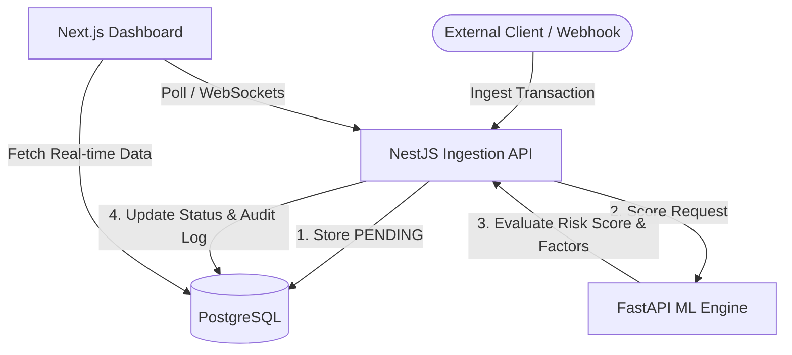

# 🛡️ Fraudies - Enterprise Fraud Detection Platform

Welcome to **Fraudies**, a high-performance, real-time enterprise fraud detection platform. Built using a modular monorepo architecture, Fraudies combines deterministic rules with machine learning predictions to flag, analyze, and audit transaction streams at scale.

---

## 🏗️ Architecture Overview

Fraudies is structured with a clean separation between frontend and backend, containing front-end interfaces, back-end ingestion and orchestration services, and a dedicated machine learning scoring service.



### Flow of a Transaction
1. **Ingestion**: A user transaction is submitted to the NestJS API (either via the frontend dashboard or external webhook).
2. **Persistence**: The transaction is immediately logged in the PostgreSQL database with a `PENDING` status.
3. **Risk Scoring**: The API routes the transaction metadata to the FastAPI ML Engine.
4. **Assessment**: The ML Engine runs feature-based models to calculate a risk score (from `0.0` to `1.0`), identify risk factors, and determine if the transaction should be `APPROVED`, `PENDING`, or `FLAGGED`.
5. **Audit Trail**: The NestJS API records the final score/status in PostgreSQL and generates an immutable entry in the `AuditLog` table.
6. **Real-time Monitoring**: The Next.js dashboard updates in real-time, displaying alert statuses and metrics to analysts.

---

## 📁 Repository Structure

```
fintech-fraudies/
├── frontend/          # Next.js & GSAP frontend dashboard
│   ├── app/           # Next.js app directory
│   ├── components/    # React components including shared UI
│   ├── lib/           # Utility functions and API client
│   └── public/        # Static assets
├── backend/
│   ├── api/           # NestJS REST API (Core Business Logic & Routing)
│   ├── ml-engine/     # FastAPI Python service hosting the ML models
│   └── database/      # Prisma schema, Client, and migrations
├── docker-compose.yml # PostgreSQL & Redis database containers
└── package.json       # Root package configuration
```

---

## ⚙️ Technology Stack

| Component | Technology | Description |
| :--- | :--- | :--- |
| **Frontend** | [Next.js 14](https://nextjs.org/) + Tailwind CSS | React framework for web development, featuring glassmorphism and modern dark-mode layouts. |
| **Animations** | [GSAP](https://gsap.com/) | Smooth, micro-animations for cards, metrics, and list transitions. |
| **Backend API** | [NestJS](https://nestjs.com/) | High-throughput, TypeScript-based REST API handling user auth, webhooks, and orchestration. |
| **ML Engine** | [FastAPI](https://fastapi.tiangolo.com/) + PyData Stack | High-performance Python API running Scikit-Learn predictions (with numpy, pandas, pydantic). |
| **Database** | [PostgreSQL](https://www.postgresql.org/) + Prisma | Relational store for transaction records, user tables, and system audit logs. |
| **Caching** | [Redis](https://redis.io/) | In-memory key-value store optimized for deterministic velocity checks (under 1ms). |


---

## 🚀 Getting Started

Follow these steps to run the complete environment locally.

### 📋 Prerequisites
Make sure you have the following installed on your system:
- **Node.js** (v18 or higher)
- **Docker** and **Docker Compose**
- **Python** (3.9 or higher, with `pip` and `venv` package)

---

### 1. Setup Environment Variables
Clone the template configuration to create your local `.env` file in the root directory:
```bash
cp .env.example .env
```
Ensure that the credentials match your preferences. The default credentials connect seamlessly with the Docker configuration.

### 2. Start PostgreSQL & Redis Services
Launch the background database containers using Docker Compose:
```bash
npm run docker:up
```

### 3. Install Dependencies
Install dependencies for both frontend and backend:
```bash
npm run install:all
```

Or manually:
```bash
# Install frontend dependencies
cd frontend
npm install

# Install backend dependencies
cd ../backend/api
npm install
```

### 4. Database Setup & Migrations
Create your PostgreSQL database schemas and generate the Prisma Client:
```bash
# Generate the shared prisma client
npm run db:generate

# Apply migrations to local postgres instance
npm run db:migrate
```

### 5. Setup Python ML Engine
The ML engine is a Python service. You should run it within a virtual environment.
```bash
# Navigate to the ML engine directory
cd backend/ml-engine

# Create virtual environment
python -m venv .venv

# Activate virtual environment
# On Windows (Command Prompt):
.venv\Scripts\activate.bat
# On Windows (PowerShell):
.venv\Scripts\Activate.ps1
# On Linux/macOS:
source .venv/bin/activate

# Install requirements
pip install -r requirements.txt

# Start ML Engine (FastAPI runs on port 8000)
uvicorn app.main:app --reload --port 8000
```

### 6. Start the Web Dashboard and API
Open separate terminal windows to start the services:

**Terminal 1 - Frontend:**
```bash
npm run dev:frontend
```

**Terminal 2 - Backend API:**
```bash
npm run dev:backend
```

**Terminal 3 - ML Engine** (if not already running from step 5):
```bash
npm run dev:ml
```

- **Next.js Dashboard**: Accessible at [http://localhost:3000](http://localhost:3000)
- **NestJS API Server**: Running at [http://localhost:3001/api/v1](http://localhost:3001/api/v1)
- **FastAPI ML Engine**: Running at [http://localhost:8000](http://localhost:8000)

---

## 🔌 API Endpoints Reference

### Ingestion API (NestJS - `http://localhost:3001/api/v1`)
- `POST /auth/register` - Create a new user.
- `POST /auth/login` - Authenticate a user and receive a JWT.
- `POST /transactions` - Create a transaction manually (Authenticated).
- `GET /transactions` - Fetch all transactions for the authenticated user.
- `GET /transactions/stats` - Fetch aggregate metrics (volume, counts, alerts).
- `POST /transactions/webhook` - Ingest external transactions. Requires `X-Webhook-Secret` header.

### Machine Learning API (FastAPI - `http://localhost:8000`)
- `GET /` - Health check verification endpoint.
- `POST /predict` - Accepts raw transaction features and outputs a prediction score.
  ```json
  // Request
  {
    "transactionId": "TX-1234",
    "userId": "usr_99",
    "amount": 6200.0,
    "type": "TRANSFER",
    "ipAddress": "192.168.1.1",
    "deviceId": "dev_hash_99"
  }
  
  // Response
  {
    "transactionId": "TX-1234",
    "riskScore": 0.81,
    "status": "FLAGGED",
    "factors": [
      "Large transaction amount ($6,200.00)",
      "High-risk transaction type (TRANSFER)"
    ]
  }
  ```

---

## 🛠️ Available Scripts

### Development
- Start frontend: `npm run dev:frontend`
- Start backend API: `npm run dev:backend`
- Start ML engine: `npm run dev:ml`

### Production Build
- Build frontend: `npm run build:frontend`
- Build backend: `npm run build:backend`

### Database Management
- Generate Prisma client: `npm run db:generate`
- Run migrations: `npm run db:migrate`
- Open Prisma Studio: `npm run db:studio`

### Docker
- Start databases: `npm run docker:up`
- Stop databases: `npm run docker:down`

---

## 🛡️ License
This project is proprietary and intended for enterprise evaluation purposes. All rights reserved.
